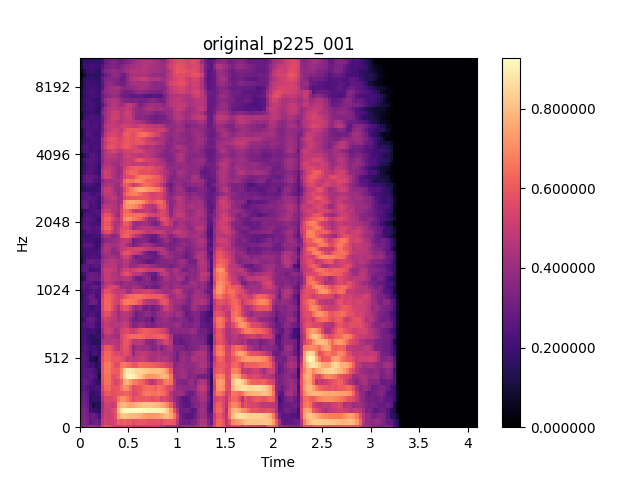
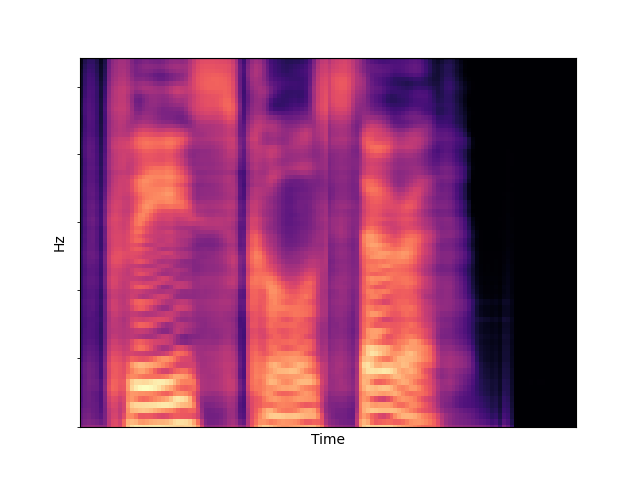

# Abstract
Voice conversion is a challenging task which transformsvoice characteristics of a source speaker to a target speakerwithout  changing  linguistic  content. Recently, there  havebeen many works on many-to-many Voice Conversion (VC)based on Variational Autoencoder (VAEs)  achieving goodresults , however, these  methods lack the ability to disen-tangle speaker identity and linguistic content to achieve wellgeneralized performance. In this paper, we propose a  new method based on feature disentanglement to tackle many-to-many VC. By capability of disentangling speaker identityand linguistic content from utterances, Disentangle-VAE canconvert from many source speakers to many target speakerswith a single autoencoder network. Moreover, it achieves well generalized  performance with unseen target speakers. We perform both objective and subjective evaluation to verifythat our proposed method is able to transform source utterances to target utterance with high audio naturalness andtarget speaker similarity.

# Melspectrogram Visualization

We conducted experiments on melspectrograms feature and relized that the speaker embedding has significant impact to melspectrograms. This phenomenon 
explains for our assumption which is there are some common factors represent speaker identity embedded in speaker embedding, the other distinct factors represent linguishtic content extracted in content latent vector. Hence, by swapping speaker embedding between two utterance Disentangle-VAE is able to transform the identity of source speaker to the identity of target speaker.  

The script: "Please call Stela"

|  Original utterance (Female)   |     Converted utterance (Male)       |
|:------------------------------:|:------------------------------------:|
|  |    |
| <audio src="p225_001.wav" controls preload size=5></audio> |   <audio src="convert_p225_to_p226_001.wav" controls preload size=5></audio>   |

# Male &#8594; Female

|          | Source | Target | Disentangled-VAE | AutoVC | VQVC+ | Cycle-VAE |
|----------|--------|--------|------------------|-----------|-------|--------|
| sample 1 |   <audio src="./M2F/p232_003.wav" controls preload size=5></audio>   |    <audio src="./M2F/p229_003.wav" controls preload size=5></audio>   |  <audio src="./M2F/[Dis-VAE]convert_p232_to_p229_003.wav" controls preload size=5></audio>|  <audio src="./M2F/[Autovc]p232_to_p229_0003.wav" controls preload size=5></audio>  |  <audio src="./M2F/[VQVC+]p225_p226_003.wav" controls preload size=5></audio>   |  <audio src="./M2F/[Cycle-VAE]p226_003_cv.wav" controls preload size=5></audio>       

| sample 2 |   <audio src="./M2F/p232_004.wav" controls preload></audio>   |    <audio src="./M2F/p229_004.wav" controls preload></audio>   |  <audio src="./M2F/[Dis-VAE]convert_p232_to_p229_004.wav" controls preload></audio>     |   <audio src="./M2F/[Autovc]p232_to_p229_0004.wav" controls preload></audio>   |   <audio src="./M2F/[VQVC+]p225_p226_004.wav" controls preload></audio>   | <audio src="./M2F/[Cycle-VAE]p226_004_cv.wav" controls preload size=5></audio> |

# Female &#8594; Male

|          | Source | Target | Disentangled-VAE | AutoVC | VQVC+ | Cycle-VAE |
|----------|--------|--------|------------------|-----------|-------|-------|
| sample 1 |   <audio src="./F2M/p225_003.wav" controls preload></audio>   |    <audio src="./F2M/p226_003.wav" controls preload></audio>   |  <audio src="./F2M/[Dis-VAE]p225_to_p226_003.wav" controls preload></audio>|  <audio src="./F2M/[Autovc]p225_to_p226_0003.wav" controls preload></audio>  |  <audio src="./F2M/[VQVC+]p225_p226_003.wav" controls preload></audio>   | <audio src="./M2F/[Cycle-VAE]p225_003_cv.wav" controls preload size=5></audio> |       

| sample 2 |   <audio src="./F2M/p225_010.wav" controls preload></audio>   |    <audio src="./F2M/p226_010.wav" controls preload></audio>   |  <audio src="./F2M/[Dis-VAe]p225_to_p226_010.wav" controls preload></audio>     |   <audio src="./F2M/[Autovc]p225_to_p226_00010.wav" controls preload></audio>   |   <audio src="./F2M/[VQVC+]p225_p226_0010.wav" controls preload></audio>   | <audio src="./M2F/[Cycle-VAE]p225_010_cv.wav" controls preload size=5></audio> |

# Female &#8594; Female

|          | Source | Target | Disentangled-VAE | AutoVC | VQVC+ | Cycle-VAE |
|----------|--------|--------|------------------|-----------|-------|--------|
| sample 1 |   <audio src="./F2F/p229_003.wav" controls preload></audio>   |    <audio src="./F2F/p225_003.wav" controls preload></audio>   |  <audio src="./F2F/[Dis-VAE]p229_to_p225_003.wav" controls preload></audio>|  <audio src="./F2F/[Autovc]p229_to_p225_0003.wav" controls preload></audio>  |  <audio src="./F2F/[VQVC+]p229_p225_003.wav" controls preload></audio>   | <audio src="./F2F/[Cycle-VAE]p229_003_cv.wav" controls preload></audio> |       

| sample 2 |   <audio src="./F2F/p229_004.wav" controls preload></audio>   |    <audio src="./F2F/p225_004.wav" controls preload></audio>   |  <audio src="./F2F/[Dis-VAE]convert_p229_to_p225_004.wav" controls preload></audio>     |   <audio src="./F2F/[Autovc]p229_to_p225_0004.wav" controls preload></audio>   |   <audio src="./F2F/[VQVC+]p229_p225_004.wav" controls preload></audio>   | <audio src="./F2F/[Cycle-VAE]p229_004_cv.wav" controls preload></audio> |

# Male &#8594; Male

|          | Source | Target | Disentangled-VAE | AutoVC | VQVC+ | Cycle-VAE |
|----------|--------|--------|------------------|-----------|-------|-------|
| sample 1 |   <audio src="./M2M/p226_006.wav" controls preload></audio>   |    <audio src="./M2M/p232_006.wav" controls preload></audio>   |  <audio src="./M2M/[Dis-VAE]convert_p226_to_p232_006.wav" controls preload></audio>|  <audio src="./M2M/[Autovc]p226_to_p232_0006.wav" controls preload></audio>  |  <audio src="./M2M/[VQVC+]p226_p232_006.wav" controls preload></audio>   |  <audio src="./M2M/[Cycle-VAE]p232_006_cv.wav" controls preload></audio> |      

| sample 2 |   <audio src="./M2M/p226_009.wav" controls preload></audio>   |    <audio src="./M2M/p232_009.wav" controls preload></audio>   |  <audio src="./M2M/[Dis-VAE]convert_p226_to_p232_009.wav" controls preload></audio>     |   <audio src="./M2M/[Autovc]p226_to_p232_0009.wav" controls preload></audio>   |   <audio src="./M2M/[VQVC+]p226_p232_009.wav" controls preload></audio>   | <audio src="./M2M/[Cycle-VAE]p232_009_cv.wav" controls preload></audio> |

